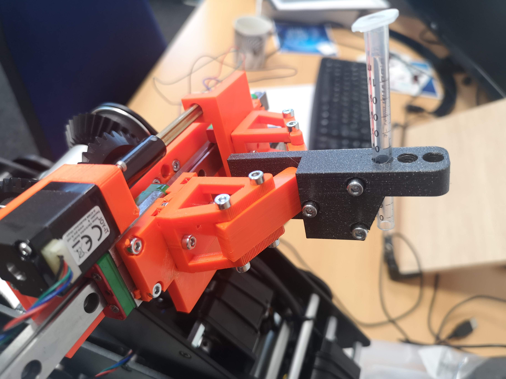
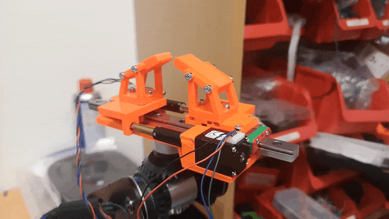
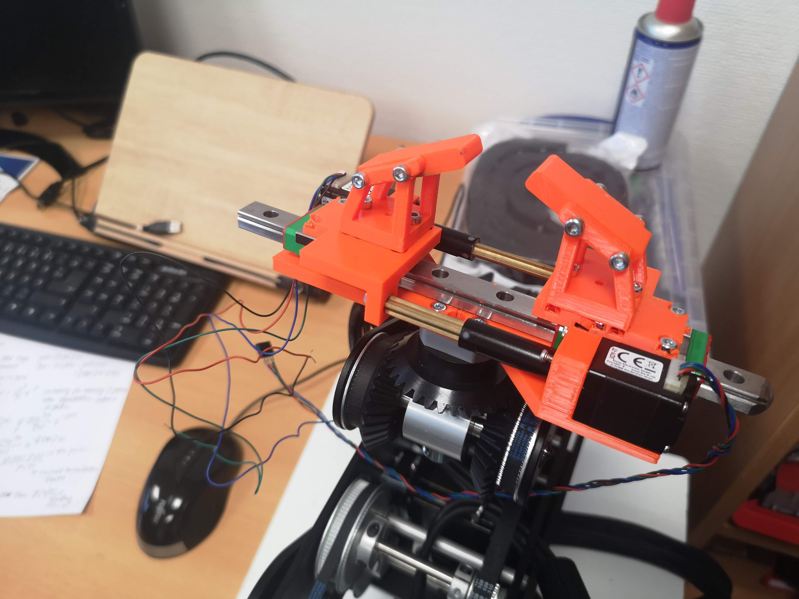

<p align="left">
<a href="#logo" name="logo"></a>
</p>

# openUC2 *UC2 Dorna.ai Gripper*
---

This repository will help you to build and setup the linear gripper that can carry wellplates, syringes and other neat things to make your microscope more .. well .. robotic 🤖🤖🤖.


The tool can be mounted on (any robot, but moutns perfectly on the) Dorna.ai 2 robot arm. It's terribly overengineered and makes use of two linear stepper motors that move the two finger independently. Anyway. This way, we can translate "stuff" linearly AND gripe it with micrometer precision - which we think is useful to e.g. deliver samples to pipetting robots or OpenUC2 light-sheet systems.

Curious to see what this looks like? Keep scrolling!


<p align="center">
<a href="#logo" name="logo"></a>
</p>

The overall price is in the range of ~200 €.


***Features:***
* 2 non-captive linear stepper motors
* linear rail to add stability (MGN12H)
* Changable fingers/tools


## In-Action

An example of grabbing a magnetic light-sheet sample mount and linearly move it in one direction.

<p align="center">
<a href="#logo" name="logo"></a>
</p>


# Software

We control it with the UC2-ESP32 firmware running on the ESP32. Additional information can be found here: https://github.com/youseetoo/uc2-esp32/ and http://openuc2.github.io/.


## Custom Python code

The below code runs the motion visible in the video above:

```py
#%%
#
import uc2rest
import numpy as np
import time

port = "unknown"
port = "/dev/cu.SLAB_USBtoUART"
port = "/dev/cu.wchusbserial14310"
#port = "/dev/cu.wchusbserial1440"
port = "/dev/cu.wchusbserial110"

ESP32 = uc2rest.UC2Client(serialport=port)
# setting debug output of the ser'ial to true - all message will be printed
ESP32.serial.DEBUG=True

#%%
time.sleep(0)
#fully open
speed = 15000

ESP32.motor.move_xyzt(steps=(0,20000,-20000,0), speed=speed, is_blocking=True)
#time.sleep(.5)

# move to center
ESP32.motor.move_xyzt(steps=(0,-10000,10000,0), speed=speed, is_blocking=True)
#time.sleep(.5)

# open
ESP32.motor.move_xyzt(steps=(0,5000,-5000,0), speed=speed, is_blocking=True)
#time.sleep(.5)

# close
ESP32.motor.move_xyzt(steps=(0,-5000,5000,0), speed=speed, is_blocking=True)
#time.sleep(.5)

# both move left
ESP32.motor.move_xyzt(steps=(0,-5000,-5000,0), speed=speed, is_blocking=True)
#time.sleep(.5)

# both move right
ESP32.motor.move_xyzt(steps=(0,5000,5000,0), speed=speed, is_blocking=True)
#time.sleep(.5)


# %
speed =1000
# both move left
ESP32.motor.move_xyzt(steps=(0,-5000,-5000,0), speed=speed, is_blocking=True)
#time.sleep(.5)

# both move right
ESP32.motor.move_xyzt(steps=(0,5000,5000,0), speed=speed, is_blocking=True)
#time.sleep(.5)
# %%
```


# Hardware

Below we describe how the device can be build and assembled in order to replicate the whole system as shown in the rendering above. One needs additional parts that can be found in the core [openUC2 repository](https://github.com/bionanoimaging/UC2-GIT).


## Bill of material

Below you will find all components necessary to build this device

### 3D printing files

All these files need to be printed. We used a Prusa i3 MK3 using PETG Prusament (Orange) at layer height 0.3 mm and infill 100%.


All files can be found in the folder [./STL](./STL)
### Additional parts
This is used in the current version of the setup

|  Type | Details  |  Price | Link  |
|---|---|---|---|
| Joy It captive stepper motor | NEMA8 |  60 € | [Pollin](https://www.pollin.de/p/joy-it-schrittmotor-nema08-04la-b20shd4353-c38l-0-5kg-5-28v-0-24a-20x22x27-5-310849?utm_source=google&utm_medium=fshopping&gclid=Cj0KCQiAtvSdBhD0ARIsAPf8oNldR6nm0HW7yZfGmP3uehqCQv8dbL60tWlKPCMHk-KJEC2soM3b4dcaApBTEALw_wcB)  |
| 2x MGN12H Block | Linear |  12 € | [Roboterbausatz](https://www.roboter-bausatz.de/p/mgn12h-linearlager)  |
| 20cm MGN12H Rail | Linear |  12 € | [Roboterbausatz](https://www.roboter-bausatz.de/p/linearfuehrung-mgn12h-100mm)  |


### Design files

The original design files are in the [INVENTOR](./INVENTOR) folder.

### Electronics

Please have a look here: https://youseetoo.github.io/


### Assembly of the DEVICE

 For assembling the device you only need some M3 screws and nuts to hold the parts together as shown in the photo below. The steppers need to be hooked up to the stepper controller.

 Controlling it through the Dorna-LAB works as follows:

 Use the UC2-ESP Software to control the motors. Either use the UC2-REST Python interface https://github.com/openUC2/UC2-REST/ which can be used in the same jupyter notebook or alter the code to have the following setup:

 **dorna controlbox** -> **PWM** -> **UC2-ESP** -> translate Analog into Stepper position.

## Showcase

Rendering of the gripper on the Dorna.ai

<p align="center">
<a> </a>
</p>

<p align="center">
<a> </a>
</p>


## Get Involved

This project is open so that anyone can get involved. You don't even have to learn CAD designing or programming. Find ways you can contribute in  [CONTRIBUTING](https://github.com/openUC2/UC2-GIT/blob/master/CONTRIBUTING.md)


## License and Collaboration

This project is open-source and is released under the CERN open hardware license. Our aim is to make the kits commercially available.
We encourage everyone who is using our Toolbox to share their results and ideas, so that the Toolbox keeps improving. It should serve as a easy-to-use and easy-to-access general purpose building block solution for the area of STEAM education. All the design files are generally for free, but we would like to hear from you how is it going.

You're free to fork the project and enhance it. If you have any suggestions to improve it or add any additional functions make a pull-request or file an issue.

Please find the type of licenses [here](https://github.com/openUC2/UC2-GIT/blob/master/License.md)

REMARK: All files have been designed using Autodesk Inventor 2019 (EDUCATION)


## Collaborating
If you find this project useful, please like this repository, follow us on Twitter and cite the webpage! :-)
